# Control and Trajectory Tracking for Autonomous Vehicles Project

Up to this point in the course we looked at car controls in at the macro level; Observing the world, placing the car in the world, planning a course through the world. This section of the course dealt with how to convert those plans into commands to steering, power plant, and breaking commands in a meaningful way that each of those subsystems can act on.

Control system is a large area of study and this course took a very rough look at a closed loop controller called "PID Controller" or Proportional Integral Differential controller. They way the controller was presented was in its most basic form without any formal math theory of control theory behind it. All methods presented in this course were in a holistic fashion and should not be applied to an actual safety critical system but serves an an introduction.

## Part 1 Build the PID controller object
This was to implement a simple PID controller with output limits.

This is found in the [pid_controller.h](../project/pid_controller/pid_controller.h) and [pid_controller.c](../project/pid_controller/pid_controller.c) files.

Step 1 requested a screen shot be posted of the car not moving.

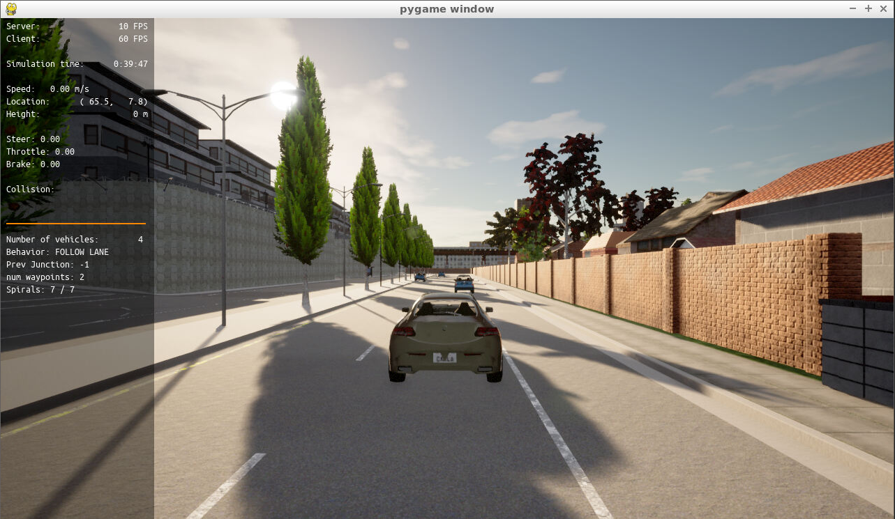

## Part 2 PID controller for throttle
Part 2 was to calculate the velocity error and initialize a PID controller to control the throttle. Along with these steps some basic book keeping to uncomment code was also done.  See
[main.cpp](../project/pid_controller/main.cpp) "part 2" tags.

The basic selection of PID paremters had the car driving forward until it braked behind the first vehicle.

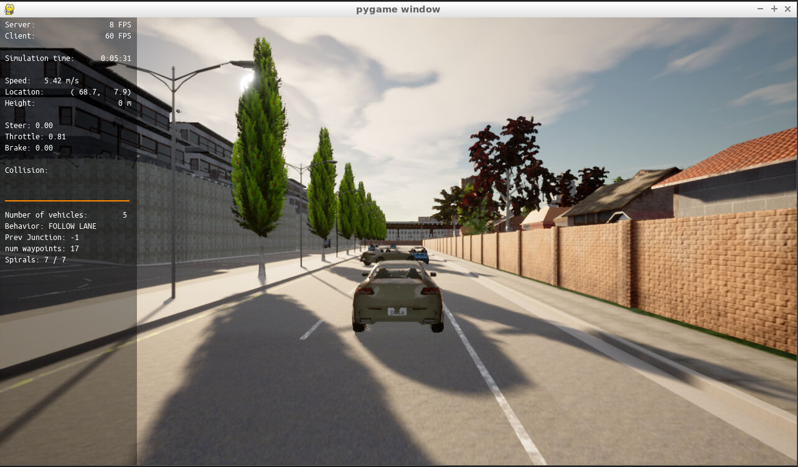

## Part 3 PID controller for steer
Part 3 was similar to [Part 2](#Part2) but to add control to the steering. It was not clear where in the path planning the car was expected to be and I took a few attempts to see how comparing different angle calculations on the error would result in the driving. I do not believe this is totally correct still but this was about PID control more so. I was able to get the car to drive to the end of the road.

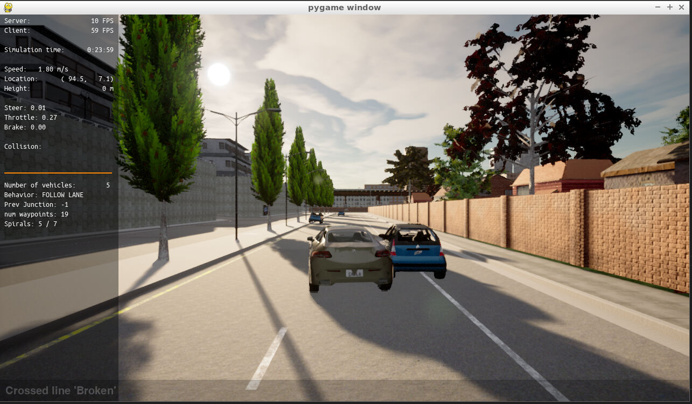

## Part 4 Evaluate the PID efficiency

The final section was to adjust the PID. As this simulation did not allow repeatability with new path planning being done based on the position of car and obstacles it made it difficult to asses what was related to PID changes and what was path planning choices.

### Run 0
Parameters
| Name     |P      | I     | D     |
| --------:|------:|------:|------:|
| Steer    |  0.4  | 0.002 | 0.05  |
| Throttle |  0.2  | 0.002 | 0.05  |

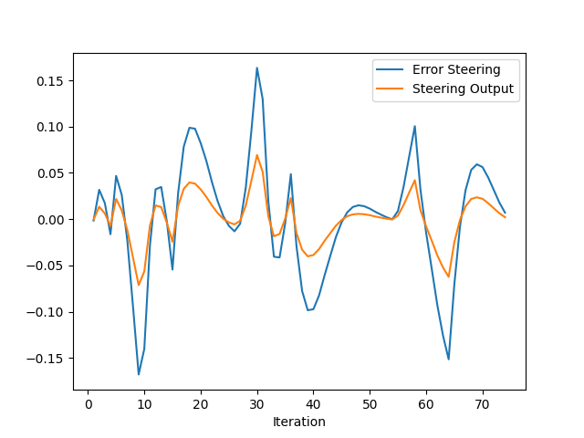
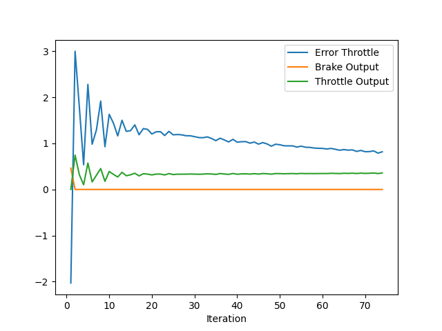

Notes:
First attempt. Car made it to end without hitting anything. Steering felt slow and never made it correct speed. The error fell very slowly. Acceleration also felt very slow with some stops.

### Run 1
Parameters
| Name     |P      | I     | D     |
| --------:|------:|------:|------:|
| Steer    |  0.4  | 0.002 | 0.05  |
| Throttle |  0.2  | 0.002 | 0.05  |

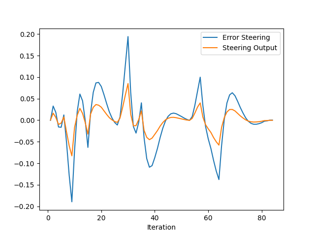
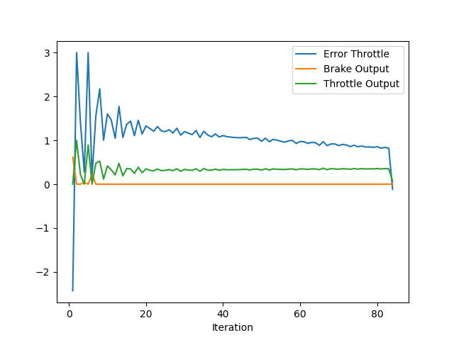

Notes:
This attempt changed the D values. The overall error was closer to the ideal 0 but was not great. This was an improvement over Run 0.

### Run 2
Parameters
| Name     |P      | I     | D     |
| --------:|------:|------:|------:|
| Steer    |  0.8  | 0.002 | 0.1   |
| Throttle |  0.4  | 0.002 | 0.1   |

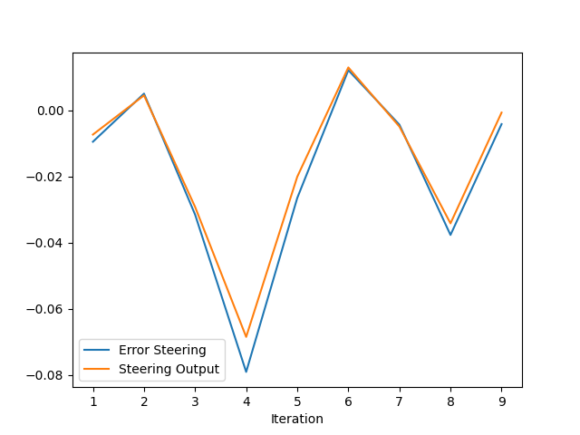
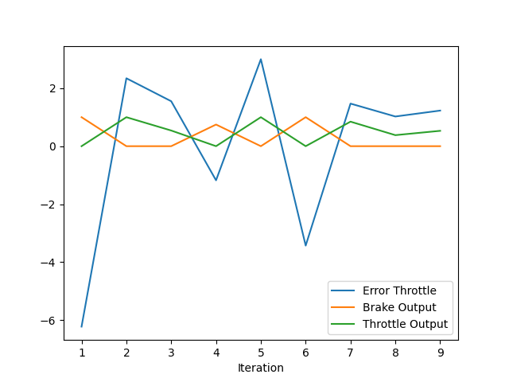

Notes: This time the P values were doubled for steering and throttle. The result was the steering angle error tracked with the output of the steering but was very sudden and not close to zero. This resulted in the car hitting a tree. However the velocity looked better and during initial acceleration the error was 1 mps better than before.

### Run 3
Parameters
| Name     |P      | I     | D     |
| --------:|------:|------:|------:|
| Steer    |  0.8  | 0.02 | 0.1   |
| Throttle |  0.4  | 0.002 | 0.1   |

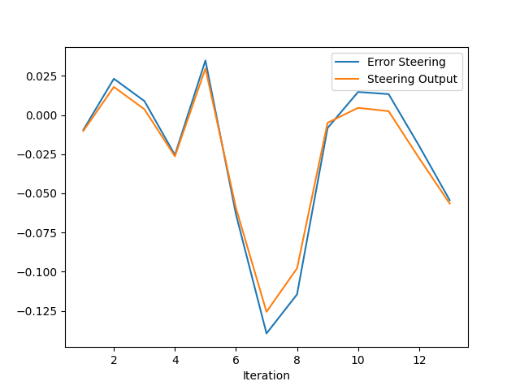

Notes: This run left the throttle alone and adjust the I value on steering. This the car missed the tree made it further but then failed to avoid another car and veered into it. I took this opportunity to try to adjust how the error was calculated but none produced satisfying results.

### Run 4
Parameters
| Name     |P      | I     | D     |
| --------:|------:|------:|------:|
| Steer    |  0.3  | 0.003 | 0.31  |
| Throttle |  0.2  | 0.001 | 0.1  |

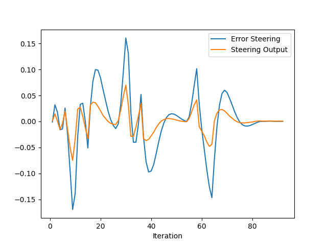
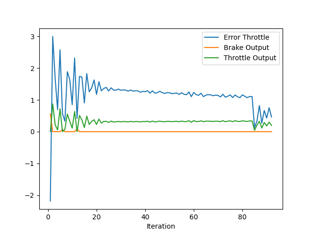

Notes: Run 4 was the final formal run I kept data. The steering was still the primarily area of concern. Going against 1 change at a time PID were all changed. The result was overall better. The error on average was closer to 0 but still have oscillations and some sudden turning but the car navigated better than on run 0. Speed error continued to be about where it has been and well off from the mark. However with steering issues the velocity did work to navigate the car and allow car to respond to the steering inputs around obstacles.

## Part 4 questions

### What is the effect of the PID according to the plots, how each part of the PID affects the control command?

P term is the workhorse to get the output close to the goal. The further away from the set point the more impact it has. It does not do well for bringing the controller to a final zero error value and does not allow for gradual changes as inputs change without being very slow.

I term attempts to close the error by keeping a "history". Remembering where the plant control error has been in the past allows a portion to be added or removed to the current setpoint. Overtime errors will make this response stronger.

D term try's to take in to account future behavior by measuring the change between the current and last error. This trys to reduce the overshoot a strong P or I term can cause reducing their effect.

However breaking a PID controller down into the 3 terms is only part of the story. All 3 interact with each other and the properties of the plant. Adjusting one may lead to the need to adjusting another.

### How would you design a way to automatically tune the PID parameters?

Having a good plant model is needed to automatically tune the PID. This can be acomplished using a physical sim (such was the one we used in this course), using a ,searching for critical values on a live plant while adjusting P/I/D to find oscillating points (See Ziegler–Nichols method), or through many other methods to that are available to try to derive PID values off of observed plant behavior or predicated plant behavior.

The current simulation and software around it has 2 large failings.

The first is not using fixed inputs to the control system. This makes comparing run to run very hard. The simulation should have supported the ability to pass in fixed patterns to help tune with before moving to one with path planning. It should at the very least support
* Step function
* Ramp

This would allow the same inputs to produce reliable outputs and errors to compare against.

The other major piece the simulation needed was the ability to simulate it for a period of time, collect the fixed data, compute PID performance, restart and rerun simulation with new values. There is no need this needs to be rendered if it can help do this quickly. In the case of virtual cars brute force searching could be used. This was the method presented in the course.

### PID controller is a model free controller, i.e. it does not use a model of the car. Could you explain the pros and cons of this type of controller?

PID controllers are simple and very lightweight. They also tend to be strong in the face of process variability.

Contrasted to feed forward control methods where the control algorithm has a high fidelity model to predict the plants output based on environment and set points these models are difficult to create, require maintenance to maintain as the plant changes over time (Bearing wear, new parts or changing spec parts, unexpected external stimuli).

However the PID controller we did was naive and cars are very complex systems. Adding some minimal smarts can help. Some simple improvments can be to have the I term history be windowed. Keeping track of the more recent past can lead to a more stable system especially when changing setpoints. When a setpoint is changed resetting the I history can allow for quick response and less sideffects from the "old" setpoint.

Adding an option in to select various PID paremters based on low vs high speed maneuvering can improve the steering. Making hard wheel lock manuevers at low speed is fine at high speed this is dangerous. A controller that does not take into account not all outputs or reactions at various speeds may be dangerous.

Adding a feed forward term to help predict the response can improve stability. Normalizing inputs into a fixed range and limiting inputs to this range can allow for better PID values.

This just touches on a very complex subject and when I saw this was included in the course I was hoping the project would be more useful for practical complex applications. I was disapointed.

### (Optional) What would you do to improve the PID controller?

From the simulation the most noticeable issue was around low speed maneuvering. As the controller went to negative on the control speed it started breaking strongly. This resulted in what would be very uncomfortable behavior. The first improvement I'd make is to allow a dead band to allow coasting instead of active breaking immediately.

